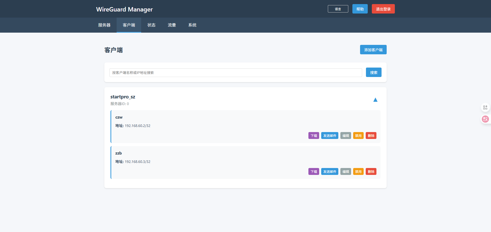
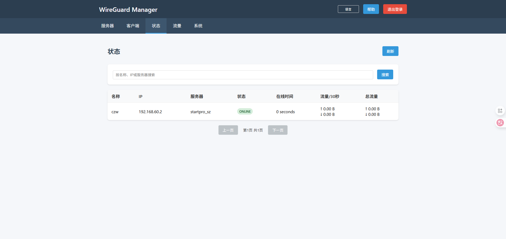
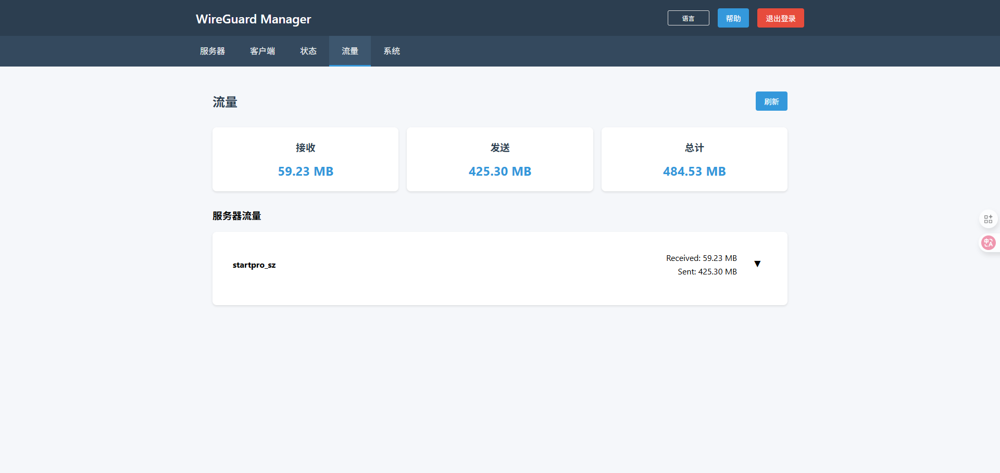
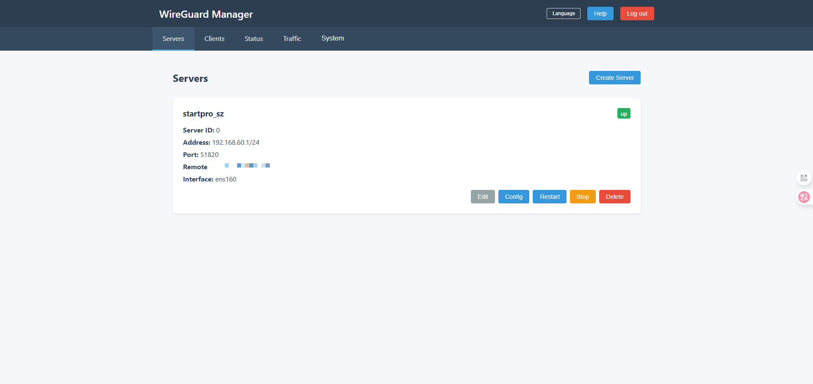
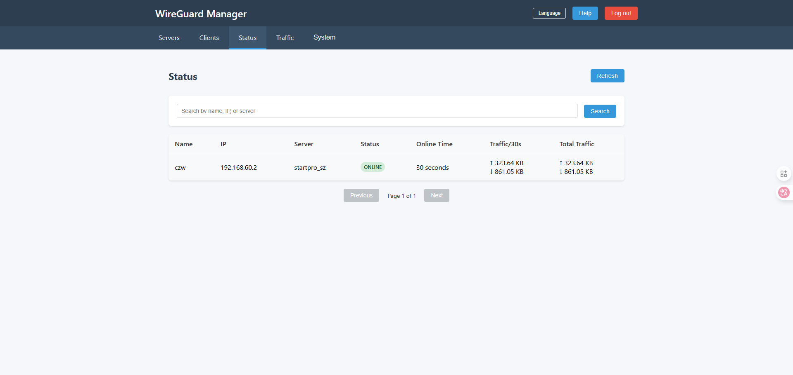
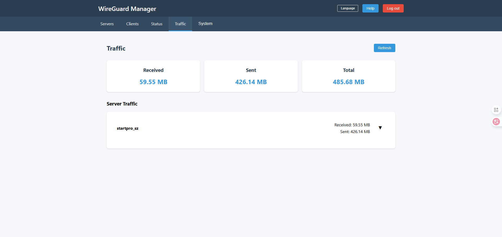

# 🌐 WireGuard Manager

### 🇨🇳 / 🇺🇸 点击切换语言

Click to switch language:

---

<details>
<summary><strong>🇨🇳 查看中文说明（点击展开）</strong></summary>

# WireGuard Manager（中文）

**WireGuard Manager** 是一个基于 Web 的 WireGuard VPN 管理平台，提供服务器管理、客户端管理、连接监控、流量统计、日志审计、SMTP 邮件发送、多语言等功能。  
适用于个人、团队与企业快速部署 WireGuard VPN。

---

## ✨ 功能特性

🔧 服务器管理

- 创建、编辑、删除多个 WireGuard 实例

- 自动生成密钥对

- 支持配置地址、端口、DNS、MTU、网络接口

### 👥 客户端管理

- 自动生成客户端配置文件

- 自动分配客户端密钥与 IP

- 自定义 AllowedIPs

- 支持邮件发送客户端配置

### 📊 状态监控与流量统计

- 服务端与客户端连接状态

- 上下行实时流量统计  
  ※ 因 WireGuard 特性，状态可能存在延迟

### 📝 访问日志

- 客户端连接/断开日志

### ✉️ 邮箱系统

- 支持 SMTP

- 自动发送配置文件

### 🌏 多语言

- 中文 / Englis

## 🧩 技术栈（Tech Stack）

| 层级             | 使用技术        |
| -------------- | ----------- |
| **前端（Web UI）** | React       |
| **后端**         | Go (Golang) |
| **数据库**        | MySQL       |

---

# 📦 安装与部署

## 一、准备系统环境

**操作系统：** Ubuntu 20.04 LTS  
**CPU：** ≥ 2 核  
**内存：** ≥ 4 GB  
**磁盘：** ≥ 10 GB

---

## 二、准备 WireGuard 环境（如未安装）

### 1. 安装 WireGuard 与依赖

`sudo apt update sudo apt install -y wireguard-tools resolvconf git curl wget nginx`

### 2. 开启 IPv4 转发

`sudo nano /etc/sysctl.conf`

添加或启用：

`net.ipv4.ip_forward=1`

立即生效：

`sudo sysctl -p`

### 3. 关闭防火墙（可选）

`sudo ufw disable`

---

## 三、准备后端运行环境

### 1. 安装 Go（如需编译）

```
wget https://go.dev/dl/go1.21.1.linux-amd64.tar.gz
sudo rm -rf /usr/local/go && sudo tar -C /usr/local -xzf go1.21.1.linux-amd64.tar.gz echo 'export PATH=$PATH:/usr/local/go/bin' >> ~/.bashrc source ~/.bashrc go version
```

### 2. 安装并初始化 MySQL

```
sudo apt install -y mysql-server
sudo systemctl start mysql
sudo systemctl enable mysql
```

初始化：

```
CREATE DATABASE wireguard_manager;
CREATE USER 'wireguard'@'localhost' IDENTIFIED BY 'wireguard123';
GRANT ALL PRIVILEGES ON wireguard_manager.* TO 'wireguard'@'localhost';
FLUSH PRIVILEGES;
```

---

## 四、通过 Nginx 发布前端

### 1. 删除默认配置

`sudo rm -f /etc/nginx/sites-enabled/default`

### 2. 复制前端配置

```
sudo cp /your_project_path/wireguard-manager/web/wireguard-manager.conf /etc/nginx/sites-available/
sudo ln -s /etc/nginx/sites-available/wireguard-manager.conf /etc/nginx/sites-enabled/
```

### 3. 拷贝静态资源

```
sudo mkdir -p /var/www/wireguard-manager
sudo cp -r /your_project_path/wireguard-manager/web/dist/* /var/www/wireguard-manager/
```

### 4. 重启 Nginx

`sudo systemctl restart nginx`

---

## 五、启动后端服务

### 1. 导入数据库

`mysql -u wireguard -pwireguard123 wireguard_manager < /your_project_path/wireguard-manager/backend/wireguard_manager_full_backup.sql`

### 2. 修改 systemd 配置路径

编辑：

`backend/wireguard-manager.server`

替换其中的 `/your_project_path`。

### 3. 启动后端

```
sudo cp /your_project_path/wireguard-manager/backend/wireguard-manager.server /etc/systemd/system/
sudo systemctl daemon-reload
sudo systemctl start wireguard-manager
sudo systemctl enable wireguard-manager
```
---

## 六、登录

浏览器访问：

`http://your_server_ip`

默认账号密码：

`admin / admin`


## 7、界面截图

<center>
  
</center>

<center>
  
</center>

<center>
  
</center>

<center>
  
</center>

</details>

---

<details>
<summary><strong>🇺🇸 View English Documentation (Click to expand)</strong></summary>

# WireGuard Manager (English)

**WireGuard Manager** is a web-based management platform for WireGuard VPN.  
It provides server management, client management, real-time monitoring, traffic statistics, access logs, SMTP email sending, and multi-language UI.

Suitable for individuals, teams, and enterprises.

---

## ✨ Features

🔧 Server Management

- Create, edit and delete multiple WireGuard instances

- Auto-generate server key pairs

- Configurable address, port, DNS, MTU, interface

### 👥 Client Management

- Auto-generate client config

- Auto-generate key pairs and client IP

- Custom AllowedIPs

- Email sending supported

### 📊 Monitoring & Traffic Stats

- Server/client online status

- Upload/download traffic stats  
  ※ State delay is normal due to WireGuard protocol

### 📝 Access Logs

- Client connect/disconnect logs

### ✉️ SMTP Support

- Send client configuration via email

### 🌏 Multi-language

- Chinese / English

## 🧩 Tech Stack

| Layer                 | Technologies |
| --------------------- | ------------ |
| **Frontend (Web UI)** | React        |
| **Backend**           | Go (Golang)  |
| **Database**          | MySQL        |

---

# 📦 Installation & Deployment

## 1. System Requirements

- Ubuntu 20.04 LTS

- CPU ≥ 2 cores

- RAM ≥ 4GB

- Disk ≥ 10GB

---

## 2. Install WireGuard Environment

### Install WireGuard & tools

`sudo apt update sudo apt install -y wireguard-tools resolvconf git curl wget nginx`

### Enable IPv4 forwarding

`sudo nano /etc/sysctl.conf`

Ensure:

`net.ipv4.ip_forward=1`

Apply:

`sudo sysctl -p`

### Disable firewall (optional)

`sudo ufw disable`

---

## 3. Backend Environment

### Install Go (if you need to recompile)

```
wget https://go.dev/dl/go1.21.1.linux-amd64.tar.gz
sudo rm -rf /usr/local/go && sudo tar -C /usr/local -xzf go1.21.1.linux-amd64.tar.gz echo 'export PATH=$PATH:/usr/local/go/bin' >> ~/.bashrc source ~/.bashrc go version
```

### Install & initialize MySQL

```
sudo apt install -y mysql-server
sudo systemctl start mysql
sudo systemctl enable mysql
```

Run:

```
CREATE DATABASE wireguard_manager;
CREATE USER 'wireguard'@'localhost' IDENTIFIED BY 'wireguard123';
GRANT ALL PRIVILEGES ON wireguard_manager.* TO 'wireguard'@'localhost';
FLUSH PRIVILEGES;
```

---

## 4. Deploy Frontend (Nginx)

### Remove default config

`sudo rm -f /etc/nginx/sites-enabled/default`

### Copy project config

```
sudo cp /your_project_path/wireguard-manager/web/wireguard-manager.conf /etc/nginx/sites-available/
sudo ln -s /etc/nginx/sites-available/wireguard-manager.conf /etc/nginx/sites-enabled/
```

### Copy frontend build files

```
sudo mkdir -p /var/www/wireguard-manager
sudo cp -r /your_project_path/wireguard-manager/web/dist/* /var/www/wireguard-manager/
```

### Restart Nginx

`sudo systemctl restart nginx`

---

## 5. Start Backend Service

### Import Database

`mysql -u wireguard -pwireguard123 wireguard_manager < /your_project_path/wireguard-manager/backend/wireguard_manager_full_backup.sql`

### Update systemd service paths

Edit:

`backend/wireguard-manager.server`

Replace `/your_project_path`.

### Deploy service

```
sudo cp /your_project_path/wireguard-manager/backend/wireguard-manager.server /etc/systemd/system/
sudo systemctl daemon-reload
sudo systemctl start wireguard-manager
sudo systemctl enable wireguard-manager
```

---

## 6. Login

Visit:

`http://your_server_ip`

Default login:

`admin / admin`

## 7. Web UI Screenshots

<center>
  
</center>

<center>
  
</center>

<center>
  
</center>

<center>
  
</center>

</details>
